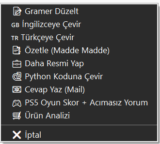
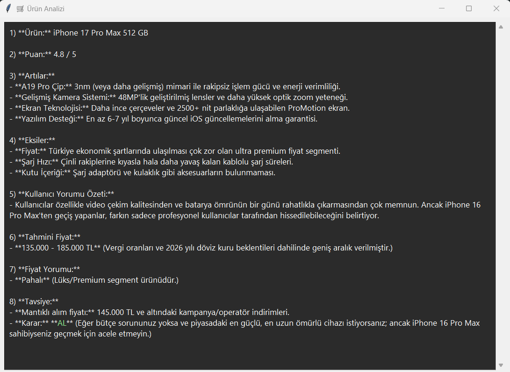
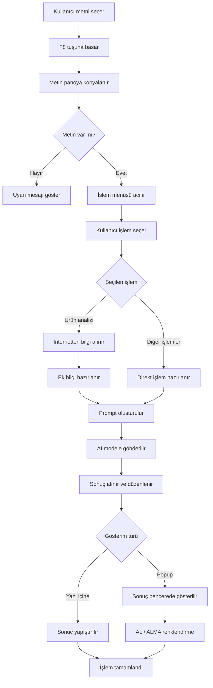

📊 AI DESTEKLİ ÜRÜN ANALİZ SİSTEMİ

🎬 Örnek Kullanım

Kullanıcı bir ürün ismini seçer ve F8'e basar:

Açılan menüden 🛒 Ürün Analizi seçilir:

📌 GENEL BAKIŞ

Bu proje, kullanıcıların günlük bilgisayar kullanımını kesmeden yapay zekâ destekli analizler alabilmesini sağlayan masaüstü tabanlı bir sistemdir.

Kullanıcı herhangi bir uygulamada (tarayıcı, PDF, Word, vs.) bir metni seçip F8 tuşuna bastığında, sistem bu metni analiz eder ve bağlama uygun yapay zekâ işlemleri sunar.

Projenin bu versiyonu özellikle ürün analizi üzerine odaklanacak şekilde geliştirilmiştir. Kullanıcı bir ürün adı seçtiğinde sistem:
- Ürünü değerlendirir.
- Artı / eksi yönlerini çıkarır.
- Kullanıcı yorumlarını özetler.
- Güncel fiyat aralığını tahmin eder.
- Satın alma tavsiyesi verir.
Bu sayede sistem, klasik bir metin işleyiciden çıkıp karar destek mekanizmasına dönüşmektedir.

🎯 PROJENİN AMACI

Bu projenin temel amacı:
- Kullanıcıdan minimum etkileşim alarak maksimum bilgi üretmek.
- Metin seçimi üzerinden bağlamı anlayan bir sistem kurmak.
- Yapay zekâyı günlük kullanım içine entegre etmek.

Klasik kullanımda kullanıcı:
* Ürün araştırır.
* Fiyat karşılaştırır.
* Yorum okur.

Bu sistem ise:
* Ürünü analiz eder.
* Özet çıkarır.
* Fiyat yorumu yapar.
* Net bir AL / ALMA kararı sunar.

🧠 SİSTEM ÖZELLİKLERİ

🔹 F8 Menü Sistemi 
Kullanıcı:
- Herhangi bir metni seçer.
- F8 tuşuna basar.
- Mouse konumunda popup menü açılır.
- Bu menü üzerinden AI işlemleri seçilir.

🔹 Metin İşleme Özellikleri
Sistem aşağıdaki işlemleri destekler:
- Gramer düzeltme
- İngilizce / Türkçe çeviri
- Metin özetleme
- Resmileştirme
- Python kodu üretimi
- Mail cevabı oluşturma

🔹 🛒 Ürün Analizi (Ana Özellik)
Kullanıcı bir ürün adı seçtiğinde sistem:
⭐ 5 üzerinden puan verir.
👍 Artı yönleri listeler.
👎 Eksi yönleri çıkarır.
💬 Kullanıcı yorumlarını özetler.
💰 Tahmini fiyat aralığı verir.
📉 Fiyat yorumu yapar.
✅ AL / ❌ ALMA kararı verir.

Ek olarak sistem:
- İnternetten veri çeker (DuckDuckGo).
- Güncel bağlam oluşturur.
- LLM’e bu veriyi verir.

🔹 🌐 GÜNCEL VERİ KULLANIMI
Sistem sadece LLM’e bağlı kalmaz.
Ek olarak:
- DuckDuckGo üzerinden arama yapar.
- İlk sonuçlardan bağlam çıkarır.
- Prompt içine ekler.
Bu sayede:
👉 Daha güncel ve gerçekçi analiz yapılır.

🔹 🖥️ POPUP SONUÇ PENCERESİ
Ürün analizi ve oyun analizi sonuçları:
- Ayrı bir popup pencerede gösterilir.
- Scroll desteklidir.
- Panoya kopyalama özelliği vardır.
Ayrıca:
✅ AL → yeşil,
❌ ALMA → kırmızı,
renk vurgusu yapılır.

⚙️ GEREKSİNİMLER

Projeyi çalıştırmak için:

1. Python
Python 3.10+

2. Gerekli Python Kütüphaneleri
pip install pyperclip pynput pyautogui requests duckduckgo_search

3. Ollama
Yerel LLM servisi gereklidir.
Kurulum:
👉 https://ollama.com

4. Model
Varsayılan model:
gemini-3-flash-preview

Alternatif:
gemma3:1b

Model yüklemek için:
ollama run gemma3:1b

5. İşletim Sistemi
Windows önerilir
(F8 global kısayol ve .bat kullanımı nedeniyle)

🚀 KURULUM

1. Projeyi indir
git clone <repo_url>
cd proje

2. Sanal ortam oluştur
python -m venv .venv

3. Aktif et
.venv\Scripts\activate

4. Paketleri yükle
pip install -r requirements.txt

5. Ollama'yı başlat
ollama serve

6. Programı çalıştır
python main.pyw

veya:

BASLAT.bat

🧑‍💻 KULLANIM

1. Herhangi bir metni seç
2. F8 tuşuna bas
3. Menüden 🛒 Ürün Analizi seç
4. Sonucu popup pencerede gör

🏗️ SİSTEM MİMARİSİ

🏁 SONUÇ

Bu proje:
- Yapay zekâyı günlük kullanım içine entegre eder.
- Minimum etkileşimle maksimum bilgi üretir.
- Pratik ve genişletilebilir bir sistemdir.

Özellikle ürün analizi özelliği ile:
👉 Kullanıcıya doğrudan karar desteği sunar.